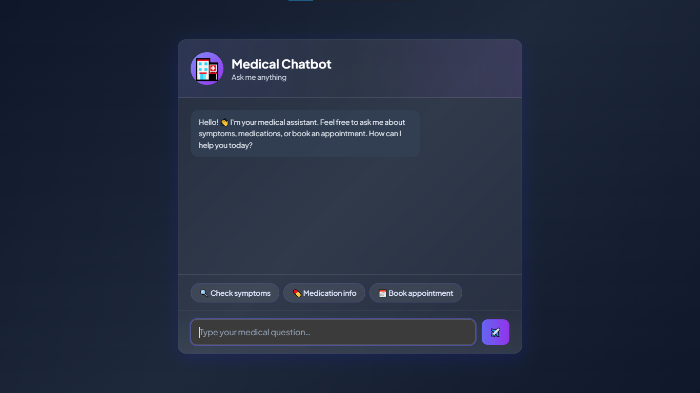

# Medical Chatbot

A FastAPI-based medical chatbot application that provides intelligent responses to medical queries.

## Features

- Interactive web interface for medical consultations
- FastAPI backend for fast and reliable performance
- Real-time chat functionality
- Clean and intuitive user interface

## Project Structure

```
medical-chatbot/
├── main.py              # FastAPI application entry point
├── templates/
│   └── index.html       # Frontend HTML template
├── README.md            # Project documentation
└── .gitignore          # Git ignore configuration
```

## Screenshot



## Installation

1. Clone the repository:
```bash
git clone <repository-url>
cd medical-chatbot
```

2. Install dependencies:
```bash
pip install fastapi uvicorn jinja2
```

3. Run the application:
```bash
python main.py
```

The application will start on `http://localhost:8000`

## Usage

1. Navigate to `http://localhost:8000` in your web browser
2. Type your medical question or query in the chat interface
3. Click send to submit your message
4. Receive responses from the chatbot

## API Endpoints

- **GET `/`** - Serves the main chat interface
- **POST `/api/chat`** - Handles user messages and returns chatbot responses

## Requirements

- Python 3.7+
- FastAPI
- Uvicorn
- Jinja2

## License

This project is licensed under the MIT License.

## Contributing

Contributions are welcome! Please feel free to submit a Pull Request.
